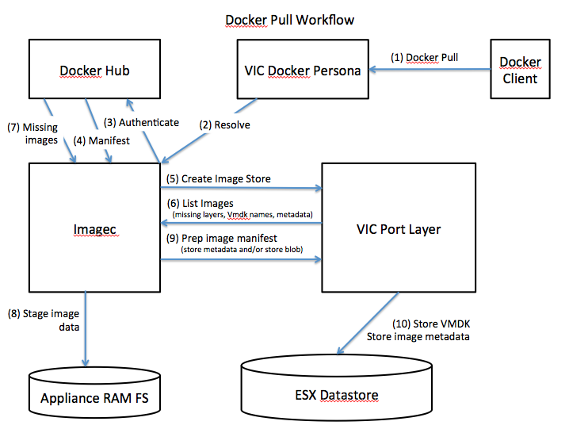

### How VIC manages filesystem images

A big part of a container runtime is how it uses and manages filesystem images. There are various approaches to managing container images, but the net result needs to be enough binaries to run the main container process. Those binaries may infact be a single statically-linked binary, or it could be a operating system dependencies, third party libraries etc.

Given that each containerVM in VIC does not share a filesystem with anything else, for a container VM to be functional, it requires the following:
* OS binaries from which to boot. These are contained in the ISO attached to the containerVM
* A disk, representing the container filesystem, mounted at "/". The disk may contain OS libraries, but must contain the binaries corresponding to the entry point of the container. The disk will typically be R/W and the underlying implementation may capture all reads into a layer which can be committed into a snapshot
* 0 or more R/W disks which persist beyond the lifespan of the container

#### Port Layer Storage

#### Imagec

Image resolution and the transfer of image data between an external repository and a local image store is something that should be able to happen out-of-band. This also means that it does not need to be a service that is tightly-coupled to any one VCH. A VCH should be able to make asyncronous requests to an image service which maintains a local image store. There is no reason the image store could not be shared between a number of VCHs. When an image is added to the store, the VCH should then be able to query the image store via the PortLayer for metadata about the image.

Given the out-of-band nature of this transaction, plus the potential for the exchange of image data to be be automated or even managed by a different control plane, it makes sense to provide a binary to allow for this. This binary is imagec https://github.com/corrieb/vic/blob/master/cmd/imagec. 

#### Image metadata

Image metadata can originate from two main sources. From the creator of the image and from the user of the image. Metadata originating from the creator will likely be in some kind of image maninfest and metadata originating from the user will be contextual data about the image, such as a user-defined tag. The scope of this metadata differs, in that the image metadata should be immutable and shared between VCHs, whereas the user-defined metadata will be scoped to a VCH. Both types of data should be persisted 

#### High-level control flow

This diagram gives a high-level overview of the control flow between the various components.

